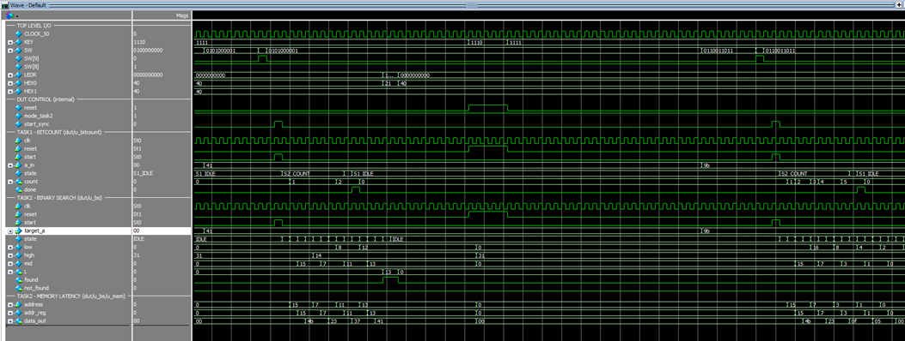
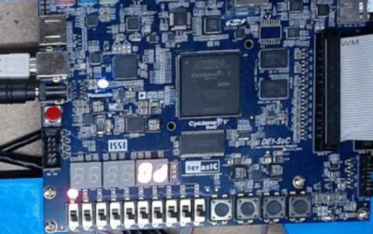

# Binary Search Hardware Accelerator (FPGA)

This project implements the binary search algorithm entirely in hardware using SystemVerilog on an Intel DE1-SoC FPGA.

Instead of running on a CPU, the search is performed by a finite state machine (FSM) connected to synchronous on-chip memory.

---

## Project Overview

The system searches a sorted memory array for an 8-bit target value.
The FPGA reads the value from switches, performs the search in hardware, and displays the result using LEDs and a 7-segment display.

**Inputs**

* target value (switches)
* start signal
* reset

**Outputs**

* FOUND indicator LED
* NOT FOUND indicator LED
* memory address (7-segment display)

---

## Architecture

### Control Path (FSM)

States:

* IDLE
* INIT
* SET_ADDR
* WAIT_DATA
* COMPARE
* FOUND
* NOT_FOUND

### Datapath

* address register
* low/high registers
* midpoint calculation
* comparator
* synchronous memory

---

## Key Engineering Challenge – Synchronous Memory Latency

The on-chip memory is synchronous.
When an address changes, the data is not valid until the next clock cycle.

Initially, the system compared data immediately after changing the address, producing incorrect results.

I fixed this by adding a **WAIT_DATA** state so the FSM pauses one clock cycle before performing the comparison.

After this change, the hardware search produced correct results for both found and not-found cases.

---

## Simulation Verification

The ModelSim waveform below shows:

* FSM state transitions
* address updates during binary search
* memory latency (data valid one clock after address)
* correct assertion of the FOUND signal

---

## Hardware Verification

The design was implemented on the Intel DE1-SoC FPGA board.

I entered target values using the switches.
The FSM searched the sorted memory and indicated the result using LEDs and the 7-segment display.

The illuminated LED shows the search result, and the hexadecimal number corresponds to the memory address where the value was found.

---

## Debugging Experience

During testing I noticed the switch positions did not match expected binary values.
I determined the board inputs were **active-low**, meaning the FPGA receives the inverted logic level.

After accounting for input polarity, the hardware behavior matched the simulation.

---

## Skills Demonstrated

* SystemVerilog RTL design
* Finite State Machine (FSM) architecture
* synchronous memory interfacing
* timing debugging
* ModelSim waveform verification
* FPGA hardware bring-up
