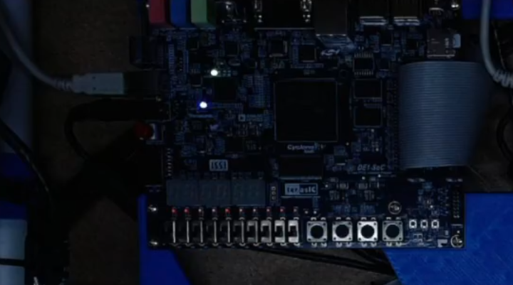

# VGA Line Drawing Engine (FPGA Graphics)

This project implements a hardware graphics system that draws lines directly on a VGA display using an FPGA.

The design generates pixel coordinates in hardware and writes them into a framebuffer, allowing the FPGA to render graphics without using a CPU.

---

## Project Overview

The system implements Bresenham’s line drawing algorithm using a finite state machine (FSM).

During operation:

1. The screen is cleared.
2. The line generator produces pixel coordinates.
3. Each pixel is written into video memory.
4. The VGA controller continuously outputs pixel data to the monitor.

The line is rendered pixel-by-pixel entirely in hardware.

---

## Hardware Platform

FPGA board: **Intel DE1-SoC (Cyclone V FPGA)**
Display interface: **VGA output**

---

## System Architecture

The hardware system contains three main components.

### Line Generator

Implements Bresenham’s line drawing algorithm and produces the next pixel coordinate every clock cycle.

### Framebuffer

Stores pixel values and allows individual pixel updates from the line generator.

### VGA Controller

Generates horizontal and vertical synchronization signals and streams pixel data to the VGA monitor.

The modules are coordinated by a control FSM.

FSM states include:

* CLEAR – clears the framebuffer
* DRAW – draws the line pixel-by-pixel
* HOLD – keeps the final image displayed

---

## Simulation Verification

The waveform below shows the behavior of the VGA line drawing system in simulation.

Key signals include:

* FSM state transitions
* pixel coordinate generation (`pixel_x`, `pixel_y`)
* framebuffer write activity

The waveform confirms that the line generator produces pixel coordinates sequentially while the framebuffer is updated during the drawing process.

---

## Hardware Demonstration

The design was deployed on the **Intel DE1-SoC FPGA board** and connected to a VGA display.

After the framebuffer is cleared, the hardware line generator begins writing pixel values corresponding to the line coordinates.
The VGA controller continuously reads from memory and sends the pixel stream to the monitor.

Below are two captured outputs from the VGA display showing the rendered line.

### VGA Output Example 1

This image shows the line appearing on the VGA display after the drawing process completes.

### VGA Output Example 2

A second capture confirming that the line is rendered correctly on the display using the hardware line generator.

---

## Key Concepts Demonstrated

* FPGA-based graphics rendering
* Bresenham line drawing algorithm in hardware
* framebuffer memory architecture
* VGA timing generation
* FSM-controlled graphics pipeline
* simulation and hardware verification
